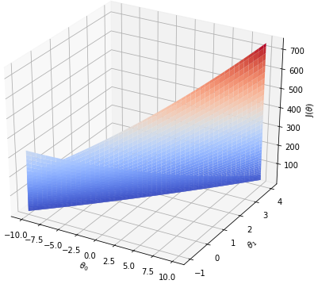
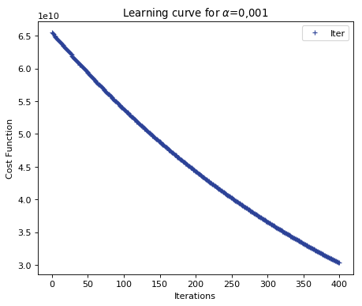
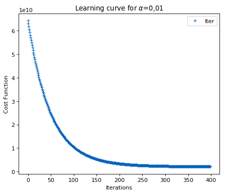
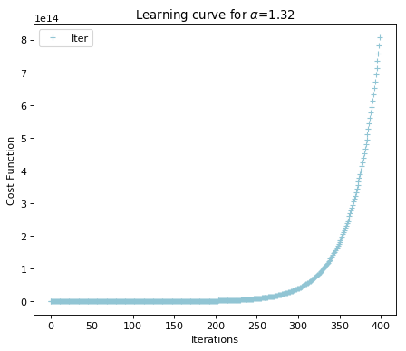

# Linear regression using python
Regression is a statistical analysis designed to understand the behavior of a sample data. This analysis was first proposed by Francis Galton in his publication: Regression Towards Mediocrity in Hereditary Stature, in the nineteenth century, in which he proposed that the size of pea seeds, whose ancestors had large stature, tended to regress to an average.
Linear regression is the regression of a series of data to a linear function. Or in other words, a linear function that represents a series of data. In this repository, we will use data from Coursera's course [Machine Learning](https://www.coursera.org/learn/machine-learning/) (Professor Andrew Ng from Stanford University), as well as follow the development steps of code and theory proposed by the course itself. However, python will be the programming language used, with the purpose of exercising the development of linear regression in another language, as well as discussing other possible paths that python libraries enable

## About the exercises
These are two exercises proposed. The first _**(ex1)**_: Suppose you own a famous food truck franchise. You will be presented with a table showing the population size of each city where the food trucks are located (column 2) and their respective profits (column 1). Apply linear regression and check if there is any correlation between these informations. If so, estimate the profit of the food truck for a population of 35,000 people and then for 70,000 people. This is a linear regression with one variable exercise.

The second exercise _**(ex2)**_: Suppose you are a resident of the of Portland city and you want to sell your house, but you do not know for sure the price to be chosen. You are presented with a table with the size, number of rooms and the price of a collection of houses in the same city. Apply linear regression and check if there is any correlation between these informations. This is a linear regression with one n-variables exercise.

```python
import pandas as pd
pathtodata = 'Exercise_Data/ex2_Data.txt'
data = pd.read_csv(pathtodata,delimiter = ',',header=None)
x = data[[0,1]] # Size of the house and (X0) and number of bedrooms (X1)
y = data[[2]] # Price of houses in Port-land
```
## Cost Function
The cost function **(J)** or loss function represents the distance of its hypothesis (in these exercises, linear hypothesis) with the real data. Therefore, the higher the cost function value, the lower the correlation between the hypothesis and the data. The cost function is represented by **equation (1)**:

<html>
<p>
<body>
    <div align="center">
<a href="https://www.codecogs.com/eqnedit.php?latex=$$J(\theta)=\frac{1}{2m}\sum_{i=1}^{m}(h_\theta(x^{(i)})-y^{(i)})^2$$" target="_blank"></a> (1) 
    </div>
</body>
</html>

The superscript _(i)_ represents the row number of the data. Where the hypothesis<a href="https://www.codecogs.com/eqnedit.php?latex=\inline&space;$h_\theta$" target="_blank"></a> is given by the linear equation (2):

<html>
<p>
<body>
    <div align="center">
<a href="https://www.codecogs.com/eqnedit.php?latex=\inline&space;$$h_\theta=\theta^T&space;x&space;=&space;\theta_0&space;x_0&plus;&space;\theta_n&space;x_n$$" target="_blank"></a> (2)
    </div>
</body>
</html>

The _**computeCost**_ file shows the step-by-step implementation of these equations.

## Gradient Descent
The gradient descent is one of the methods to optimize the hypothesis, in other words, a method to reduce the cost function. The program will learn to choose the best hypothesis, following the derivative of the cost function. **Figure** 1 shows the displacement of the cost function according to the values of parameters <a href="https://www.codecogs.com/eqnedit.php?latex=\inline&space;\theta_0" target="_blank"></a> and <a href="https://www.codecogs.com/eqnedit.php?latex=\inline&space;\theta_1" target="_blank"></a>. **Equation (3)** shows how the optimization of these parameters is performed. The _**gradientDescent**_ file shows the development of this method.

<html>
<p>
<body>
    <div align="center">
<a href="https://www.codecogs.com/eqnedit.php?latex=\inline&space;\theta_j:=\theta_j&space;&minus;\alpha\frac{1}{m}\sum_{i=1}^{m}(h_\theta(x^{(i)})-y^{(i)})x_j^{(i)}" target="_blank"></a> (3)
    </div>
</body>
</html>

<html>
<p>
<body>
    <div align="center">
        <p>
    </div>
</body>
<body>
    <div align="center">
   Figure 1 - Cost funtion for different values of Theta 0 and Theta 1<p>
    </div>
</body>
</html>

The subscrpit _(j)_ the number of the feature (collumn number)

## Feature Normalization
The normalization of the data is important, not only for the visualization, but also for reduce the interactions when applied the gradient descent, or in other words, faster convergence to the best values of   <a href="https://www.codecogs.com/eqnedit.php?latex=\inline&space;\theta_0" target="_blank"></a> <a href="https://www.codecogs.com/eqnedit.php?latex=\inline&space;\theta_1" target="_blank"></a>...<a href="https://www.codecogs.com/eqnedit.php?latex=\inline&space;\theta_n" target="_blank"></a>. The chosen normalization equation (4) is:

<html>
<p>
<body>
    <div align="center">
<a href="https://www.codecogs.com/eqnedit.php?latex=\inline&space;x^{norm}_j&space;=\frac{x_j^{(i)}-\mu^{(i)}}{S^{}(i)}" target="_blank"></a> (4)
    </div>
</body>
</html>

where <a href="https://www.codecogs.com/eqnedit.php?latex=\inline&space;\mu^{(i)}" target="_blank"></a> is the mean of the collumn _(i)_ and <a href="https://www.codecogs.com/eqnedit.php?latex=\inline&space;S^{(i)}" target="_blank"></a> is the difference between the maximum and minimum values of the collumn _(i)_. The _**featureNormalize**_ file shows the development of the feature normalization.

## The learning rate <a href="https://www.codecogs.com/eqnedit.php?latex=\inline&space;\alpha" target="_blank"></a>
The parameter <a href="https://www.codecogs.com/eqnedit.php?latex=\inline&space;\alpha" target="_blank"></a> in gradient descent is important to adjust the velocity of cost function convergence. It is important to understand that a bad choice of <a href="https://www.codecogs.com/eqnedit.php?latex=\inline&space;\alpha" target="_blank"></a> can impair the convergence of the cost function. **Figure 2** shows the cost function with different values of <a href="https://www.codecogs.com/eqnedit.php?latex=\inline&space;\alpha" target="_blank"></a>. In short:

<html>
<p>
<body>
    <div align="center">
        
    </div>
</body>
<body>
    <div align="center">
   Figure 2 - Learning curve for different values of alpha<p>
    </div>
</body>
</html>

- if <a href="https://www.codecogs.com/eqnedit.php?latex=\inline&space;\alpha" target="_blank"></a> is too small: slow convergence
- if <a href="https://www.codecogs.com/eqnedit.php?latex=\inline&space;\alpha" target="_blank"></a> is large: Increase of cost function or non-convergence

## Exercise 2 using scikit-learn libray
The scikit-learn library is focus on development of machine learning in python. It contains predefined algorithms that makes life easier for building ML code. In exercise 2, we will import the following libraries:

```python
from sklearn.model_selection import train_test_split
from sklearn.linear_model import LinearRegression
from sklearn import preprocessing
```

The _**preprocessing**_ performs the data normalization (the same done in the section [Feature Normalization](##feature-normalization))

```python
x_norm = pd.DataFrame(preprocessing.scale(x))
```
An interesting function is the _**train_test_split**_, where we can divide exercise data into training data and testing data. The _**test_size**_ parameter selects the percentage of data to be tested (in this case, 0.3 or 30% was chosen).

```python
[X_train, X_test, y_train, y_test] = train_test_split(x_norm,y,test_size=0.3,
random_state=101)
```
Using the training data, we can apply the fit (A linear regression) and verify the values of <a href="https://www.codecogs.com/eqnedit.php?latex=\inline&space;\theta_0" target="_blank"></a>, <a href="https://www.codecogs.com/eqnedit.php?latex=\inline&space;\theta_1" target="_blank"></a> and <a href="https://www.codecogs.com/eqnedit.php?latex=\inline&space;\theta_2" target="_blank"></a>.

```python
# Fitting the trainning data
lm.fit(X_train,y_train)

# Compute the parameters (theta_0, theta_1 and theta_2)
theta0 = pd.DataFrame(lm.intercept_)
theta = pd.DataFrame(lm.coef_)
```
